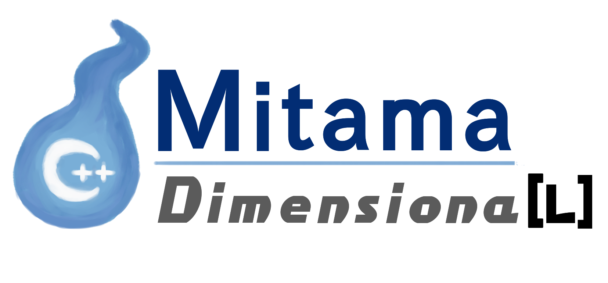

# Introduction

>"Don't trust what you compile in your brain unless you know where wording of standard is."

---------------------

## Motivation

In real world, we treat dimensional quantities (length, mass, time, ...).
And we know that addition and subtraction of quantities with different dimensions like `1 m + 2 kg` do not make sense.

Because we use a statically typed programming language C++, expressions that do not make sense should be ill-formed.
Consequently, the natural idea of ​​expressing and distinguishing dimensions by types comes out.

C++ Units Libraries already exist (e.g. Boost.Units).

However, these libraries have the problem that the quantities that can be represent are limited to *Physical Quantities*.

This library proposes a type system that does not limit available dimensions.
In this library, it becomes possible to handle physical quantities and user defined dimensions (e.g. currency) in an integrated syntax.

In addition, Mitama.Dimensional takes advantage of C++17 features/libraries and provides better syntax than the conventional Units libraries.
